# Arquitetura do Processo no GCP: Normalização, Deduplicação e Carga Incremental

Este documento descreve a arquitetura técnica implementada no **Google Cloud Platform (GCP)** com **Dataform** e **BigQuery**, cobrindo o fluxo de dados a partir da camada **RAW** até a camada **Curated**, por meio dos processos de **Normalização**, **Deduplicação** e **Processamento Incremental**.

---

## 1. Fluxograma em Mermaid (Processo Interno no GCP)

```mermaid
flowchart TB
    %% 1. Ponto de Partida: RAW no BigQuery
    subgraph BQ_RAW["1. BigQuery: Camada RAW (Ponto de Partida)"]
        direction TB
        RawTable["Tabela Bruta: raw.tb_cliente_raw\n• Dados já ingeridos no BigQuery\n• Tipos genéricos (Strings)\n• Registros repetidos e histórico versionado\n• Nulos não tratados e espaços extras"]
    end

    %% 2. Processo de Normalizacao no Dataform
    subgraph DF_NORM["2. Dataform: Fluxo de Normalizacao"]
        direction TB
        subgraph NormStrategy["Estrategia de Modelagem (definitions/normalized)"]
            NormView["Opcao VIEW (normalizacao_view.sqlx)\nTransformacao virtual em tempo de consulta\n(Ideal para baixo volume, sem custo de storage)"]
            NormTable["Opcao TABLE (normalizacao_table.sqlx)\nMaterializacao fisica particionada e clusterizada\n(Fronteira fisica para alto volume e reuso)"]
        end

        subgraph NormRules["Regras de Tratamento e Padronizacao"]
            CastTypes["Tipagem Estrita:\nCAST e SAFE_CAST (INT64, NUMERIC, DATE, TIMESTAMP)"]
            CleanStrings["Higienizacao Textual:\nUPPER(TRIM(nome)), LOWER(TRIM(email))"]
            HandleNulls["Tratamento de Nulos:\nCOALESCE(status, 'INATIVO')"]
            AuditField["Metadado de Auditoria:\nCURRENT_TIMESTAMP() AS dth_processamento"]
        end

        RawTable -->|"ref('tb_cliente_raw')"| NormStrategy
        NormStrategy --> NormRules
    end

    %% 3. Camada Normalizada no BigQuery
    subgraph BQ_NORM["3. BigQuery: Camada Normalizada (normalized)"]
        direction TB
        NormalizedData["Objeto Normalizado: normalized.tb_cliente\n• Dados limpos, padronizados e tipados\n• Particionamento: DATE(dth_atualizacao)\n• Clusterizacao: id_cliente\n• REGRA DE OURO: Preserva todo o historico (sem deduplicacao)"]
        NormRules --> NormalizedData
    end

    %% 4. Deduplicacao e Logica Incremental no Dataform
    subgraph DF_DEDUP["4. Dataform: Fluxo de Deduplicacao e Carga Incremental"]
        direction TB
        
        subgraph IncrementalBranch["Controle de Estado de Carga (incremental.sqlx)"]
            CheckIncremental{"Dataform Engine:\nincremental() ?"}
            
            FirstRun["Primeira Carga (Full Load Inicial)\n• incremental() = false\n• Sem filtro temporal (leitura completa da normalizada)\n• Deduplica todo o historico acumulado"]
            
            DeltaRun["Cargas Subsequentes (Carga Delta Incremental)\n• incremental() = true via when()\n• Janela Lookback: dth_atualizacao >= NOW - 7 DIAS\n• Suporte a dados atrasados (Late-arriving data)"]
            
            CheckIncremental -->|"Nao (Carga Inicial)"| FirstRun
            CheckIncremental -->|"Sim (Execucao Recorrente)"| DeltaRun
        end

        subgraph DedupEngine["Mecanismo de Deduplicacao Deterministica"]
            WinPartition["Chave Logica:\nPARTITION BY id_cliente"]
            WinOrder["Regra de Sobrevivencia:\nORDER BY dth_atualizacao DESC, dth_insert DESC"]
            QualifyFilter["Filtro Vencedor:\nQUALIFY ROW_NUMBER() = 1\n(Elimina duplicidade logica; DISTINCT nao resolveria)"]
            
            WinPartition --> WinOrder --> QualifyFilter
        end

        NormalizedData -->|"ref('normalizacao_table')"| IncrementalBranch
        FirstRun --> DedupEngine
        DeltaRun --> DedupEngine
    end

    %% 5. Execucao Push-Down e Materializacao no BigQuery
    subgraph BQ_CURATED["5. BigQuery: Execucao Push-Down e Camada Curated"]
        direction TB
        
        subgraph BQ_Execution["Motor de Execucao BigQuery"]
            TableCreate["Carga Inicial: CREATE OR REPLACE TABLE\nMaterializa a tabela física inicial particionada"]
            
            MergeOperation["Carga Delta: MERGE INTO curated.tb_cliente\n• updatePartitionFilter poda as particoes escaneadas (custo reduzido)\n• ON target.id_cliente = source.id_cliente\n• WHEN MATCHED THEN UPDATE (atualiza com dados recentes)\n• WHEN NOT MATCHED THEN INSERT (insere novos clientes)"]
        end

        CuratedTable["Tabela Final: curated.tb_cliente\n• Granularidade: 1 linha unica por id_cliente\n• Particionada por DATE(dth_atualizacao)\n• Clusterizada por id_cliente\n• Pronta para Analytics, BI e Consumo"]

        FirstRun --> TableCreate --> CuratedTable
        QualifyFilter --> MergeOperation --> CuratedTable
    end

    %% 6. Teste de Qualidade Automatizado
    subgraph QualityAssurance["6. Dataform: Validacao de Qualidade (Assertions)"]
        direction TB
        AssertionCheck["Assertion de Chave Primaria (assert_cliente_unique_key.sqlx)\nSELECT id_cliente, count(1) FROM curated.tb_cliente GROUP BY id_cliente HAVING count > 1\n(Bloqueia pipeline caso retorne > 0 linhas)"]
        CuratedTable -.->|"Validacao automatica"| AssertionCheck
    end

    %% Estilizacao Visual
    classDef raw fill:#fff3e0,stroke:#e65100,stroke-width:2px,color:#e65100;
    classDef norm fill:#e8f0fe,stroke:#1a73e8,stroke-width:2px,color:#1a73e8;
    classDef dedup fill:#f3e8fd,stroke:#9334e6,stroke-width:2px,color:#6b21a8;
    classDef curated fill:#e6f4ea,stroke:#137333,stroke-width:2px,color:#137333;
    classDef check fill:#fce8e6,stroke:#c5221f,stroke-width:2px,color:#a50e0e;

    class BQ_RAW,RawTable raw;
    class DF_NORM,NormStrategy,NormView,NormTable,NormRules,CastTypes,CleanStrings,HandleNulls,AuditField,BQ_NORM,NormalizedData norm;
    class DF_DEDUP,IncrementalBranch,CheckIncremental,FirstRun,DeltaRun,DedupEngine,WinPartition,WinOrder,QualifyFilter dedup;
    class BQ_CURATED,BQ_Execution,TableCreate,MergeOperation,CuratedTable curated;
    class QualityAssurance,AssertionCheck check;
```



---

## 2. Detalhamento dos Fluxos

### 2.1. Ponto de Partida: Camada RAW (`raw.tb_cliente_raw`)
Os dados brutos já se encontram armazenados no BigQuery (tabela `tb_cliente_raw`). Suas características são:
- Múltiplas linhas para uma mesma entidade (ex: um cliente pode ter várias alterações ao longo do tempo).
- Tipos de dados em formato texto genérico (strings de datas, números em formato string).
- Presença de espaços em branco, inconsistências de caixa alta/baixa e valores nulos sem representação padrão.

---

### 2.2. Fluxo de Normalização (`definitions/normalized/`)
A normalização padroniza a estrutura técnica dos dados **sem eliminar duplicatas**, preservando o histórico para a etapa subsequente.

#### VIEW vs TABLE
Conforme implementado no projeto:
1. **`normalizacao_view.sqlx` (`type: "view"`)**:
   - Cria uma visão lógica no BigQuery (`schema: "normalized"`).
   - Não gera custo de armazenamento e não duplica dados físicos.
   - Indicada quando a transformação é simples e o volume não justifica persistência intermediária.
2. **`normalizacao_table.sqlx` (`type: "table"`)**:
   - Materializa uma tabela física no BigQuery com:
     - `partitionBy: "DATE(dth_atualizacao)"`
     - `clusterBy: ["id_cliente"]`
   - Cria uma barreira física otimizada, reduzindo custos de leitura e acelerando o processamento da deduplicação em tabelas de alto volume.

#### Regras de Padronização:
- **Tipagem Segura**: `CAST(id AS INT64)`, `SAFE_CAST(valor AS NUMERIC)`, `SAFE_CAST(data_atualizacao AS TIMESTAMP)`.
- **Limpeza de Strings**: `UPPER(TRIM(nome))`, `LOWER(TRIM(email))`.
- **Tratamento de Nulos**: `COALESCE(TRIM(status), 'INATIVO')`.
- **Metadado de Auditoria**: `CURRENT_TIMESTAMP() AS dth_processamento`.

---

### 2.3. Fluxo de Deduplicação
A deduplicação consome estritamente a camada normalizada (`${ref("normalizacao_table")}`).

#### Por que `QUALIFY ROW_NUMBER()` e não `DISTINCT`?
- O `DISTINCT` elimina apenas linhas que sejam 100% idênticas em todas as colunas. Se o mesmo cliente tiver duas linhas com datas de atualização distintas, o `DISTINCT` manterá ambas, falhando na regra de negócio.
- O `QUALIFY ROW_NUMBER()` avalia o ciclo de vida lógico do registro:
  ```sql
  QUALIFY ROW_NUMBER() OVER (
      PARTITION BY id_cliente
      ORDER BY
          dth_atualizacao DESC,
          dth_insert DESC
  ) = 1
  ```
  - **Chave de Unicidade**: `PARTITION BY id_cliente`
  - **Regra de Sobrevivência**: `ORDER BY dth_atualizacao DESC` (a versão mais recente sobrevive).
  - **Critério de Desempate**: `dth_insert DESC` (garante determinismo se duas atualizações tiverem o mesmo timestamp).

---

### 2.4. Processo Incremental (`incremental.sqlx`)
O modelo incremental (`type: "incremental"`, `schema: "curated"`) otimiza tempo e custo no BigQuery:

```sql
config {
  type: "incremental",
  schema: "curated",
  uniqueKey: ["id_cliente"],
  bigquery: {
    partitionBy: "DATE(dth_atualizacao)",
    updatePartitionFilter: "dth_atualizacao >= TIMESTAMP_SUB(CURRENT_TIMESTAMP(), INTERVAL 7 DAY)"
  }
}
```

#### Comportamento das Cargas:
1. **Primeira Carga (`incremental() == false`)**:
   - A macro `${when(incremental(), ...)}` não aplica filtros de data.
   - O Dataform submete um `CREATE OR REPLACE TABLE` com toda a massa histórica deduplicada.
2. **Cargas Subsequentes (`incremental() == true`)**:
   - A macro injeta o filtro de janela temporal:
     ```sql
     WHERE dth_atualizacao >= TIMESTAMP_SUB(CURRENT_TIMESTAMP(), INTERVAL 1 DAY)
     ```
     *(ou janela de tolerância de 7 dias para dados com atraso / late-arriving data)*.
   - O Dataform deduplica apenas as linhas lidas dentro da janela móvel.
   - O Dataform compila e executa no BigQuery uma instrução `MERGE INTO curated.tb_cliente`:
     - O parâmetro `updatePartitionFilter` restringe as partições examinadas na tabela de destino aos últimos 7 dias, evitando varredura de partições históricas frias.
     - **MATCHED**: Registros existentes com o mesmo `id_cliente` são atualizados (`UPDATE`).
     - **NOT MATCHED**: Registros novos são inseridos (`INSERT`).

---

### 2.5. Validação de Qualidade (Assertions)
Após a materialização na camada `curated`, o Dataform executa consultas automáticas de qualidade:
- **Verificação de Chave Única**:
  ```sql
  SELECT
      id_cliente,
      COUNT(1) AS qtd_ocorrencias
  FROM ${ref("tb_cliente_curated")}
  GROUP BY id_cliente
  HAVING COUNT(1) > 1
  ```
- Se o BigQuery retornar qualquer linha (> 0), a assertion falha imediatamente, alertando as equipes de dados e impedindo a propagação de inconsistências para marts analíticos ou dashboards de BI.

---

## 3. Matriz Comparativa das Camadas

| Característica | Camada RAW | Camada Normalizada (`normalized`) | Camada Deduplicada / Curated (`curated`) |
| :--- | :--- | :--- | :--- |
| **Localização** | BigQuery (`raw`) | BigQuery (`normalized`) | BigQuery (`curated`) |
| **Tipo de Objeto** | Tabela física bruta | `VIEW` ou `TABLE` particionada | `TABLE` incremental particionada |
| **Tipagem dos Dados** | Genérica / Original | Estrita (`SAFE_CAST`, `CAST`) | Estrita e validada |
| **Deduplicação** | Nenhuma (dados duplicados) | Nenhuma (preserva histórico) | **Deduplicado (`ROW_NUMBER() = 1`)** |
| **Granularidade** | N linhas por entidade | N linhas por entidade | **1 linha por chave (`id_cliente`)** |
| **Modo de Carga** | Ingestão contínua | Sob demanda ou Batch | **Incremental via `MERGE` (`uniqueKey`)** |
| **Destino de Uso** | Entrada do Dataform | Entrada da Deduplicação | Consumo analítico, BI e Feature Stores |
